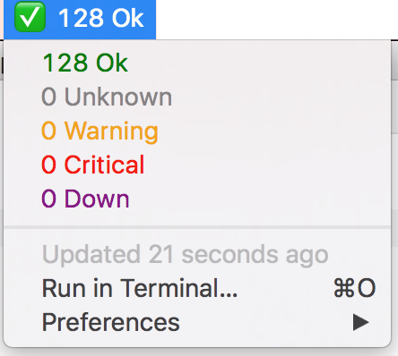

# Nagios [BitBar-Plugin](https://getbitbar.com/)

Puts nagios into your Mac OS X menu bar.

[+ Add to BitBar](bitbar://openPlugin?title=Nagios&src=https://github.com/pgolm/bitbar-nagios-plugin/raw/master/nagios.30s.sh)



## Configure

Customize the following lines in `nagios.sh` to setup your nagios server

```sh
URL="nagios.example.com/cgi-bin/nagios3"
NAME="admin"
PASSWORD="admin"
```
