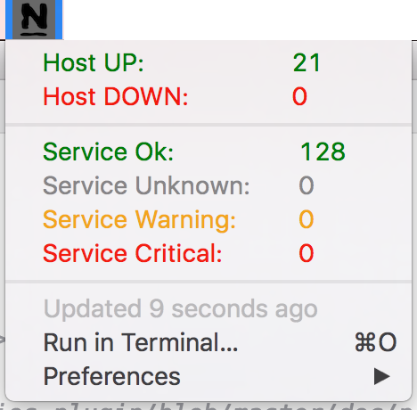

# Nagios [BitBar-Plugin](https://getbitbar.com/)

Puts nagios into your Mac OS X menu bar.

(Inspired by [Rob DeSanno's](https://raw.githubusercontent.com/matryer/bitbar-plugins/master/Dev/Nagios/nagios.30s.sh) plugin)



## Configure

Customize the following lines in `nagios.sh` to setup your nagios server

```sh
URL="nagios.example.com/cgi-bin/nagios3"
NAME="admin"
PASSWORD="admin"
```
